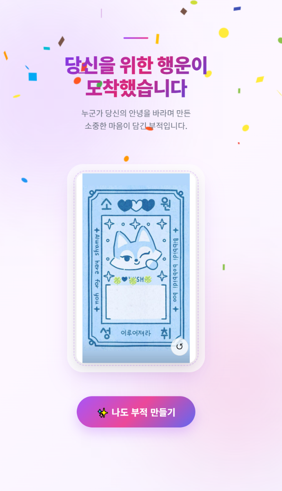
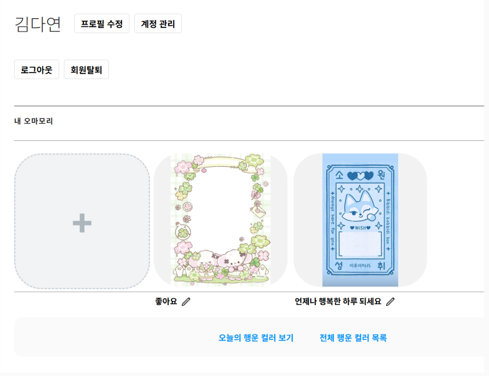

#  お守り制作 (チームプロジェクト)

> フロントエンドを担当し、設計からデプロイまで経験したWebサービスプロジェクト

---

## プロジェクト概要

お守りを制作・共有できるWebサービスです。  
チーム開発として進行し、フロントエンドを担当しました。

---

##  チーム構成

- 4人チーム
- フロントエンド担当

---

##  開発背景

バックエンド経験後、フロントエンドも担当することで  
Webサービス全体の流れを理解するために開始しました。

---

##  担当業務

- 会員機能
- お守り制作UI
- 共有機能
- ラッキーカラーUI

---

##  技術スタック

- Frontend: React, CSS, Node.js
- Backend: PHP, Laravel
- DB: PostgreSQL, S3
- Deploy: Vercel, Render

---

##  開発プロセス

### 1. 設計

- FigmaによるUI設計
- フローチャート作成
- ディレクトリ構成設計

---

### 2. 実装

- ReactベースのUI開発
- 非同期処理の実装
- npm環境での開発・テスト

---

### 3. デプロイ

- フロント: Vercel
- バックエンド: Render

---

## サービス画面

### メイン画面

### マイページ画面

---
## 課題と改善

### SPA構造の課題

- レンダリングエラー時に画面全体が崩れる問題を経験
- CSR構造の限界を理解

👉 改善  
- CSR + SSR（Next.js）構造の必要性を理解

---

##  振り返り

### 1. Web全体の流れ理解

- API → 状態管理 → UIレンダリングまでの流れを理解

---

### 2. チーム開発

- メンバーと協力しながら開発
- 説明と共有を通じて理解を深めた

---

### 3. 状態管理の重要性

- Reactの状態管理を理解
- 状態中心設計の重要性を実感

---

##  成果

- フロントエンドからデプロイまで一連の開発フローを経験
- SPA構造の課題を実体験し、SSRの必要性を理解
- チーム開発を通じたコミュニケーション能力向上
- UI実装を通じてユーザー体験を意識した開発を実践

---

##  一言まとめ

> Webサービス全体の流れと  
> 状態中心設計を学んだプロジェクト
